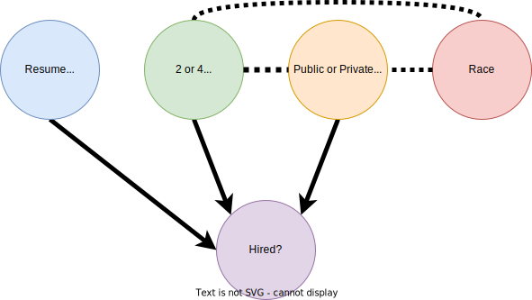
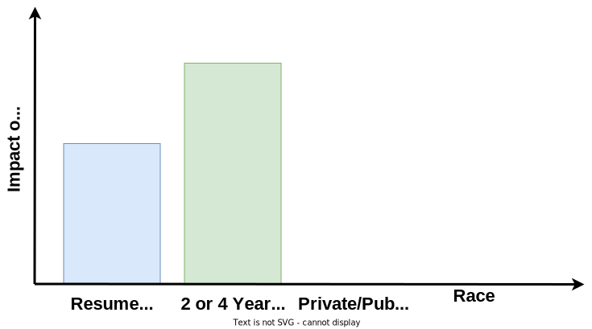

# Fair and Explainable AI (FaX-AI)

This is the official repository for fair learning methods that remove *direct discrimination* without the induction of *indirect discrimination*. These methods are based on a joining of concepts in fairness and explainability literature in machine learning. They inhibit discrimination by nullifying the influence of the protected feature on a system's output, while preserving the influence of remaining features.

This connection and the associated methods are detailed and evaluated in Marrying Explainable and Fair Supervised Models ([ICML SRML 21 workshop version](https://drive.google.com/file/d/1z24hITF0Xrlc_IX_rOZVZ2aigOj1hxhD/view?usp=sharing)).

## Example: Fair and Explainable Hiring Automation
Say we want to create an machine learning system to decide who our company should hire from a pool of applicants with college degrees. Using our company's past and, possibly, biased hiring history we put together training data with the following information from applicants:
- The legibility of their resume (assuming we can objectively score this) :blue_square:
- Whether they have a 2 year or a 4 year degree :green_square:
- Whether they went to a public or a private college/university :yellow_square:
- Their race :red_square:
- The hiring outcome (Yes/No) :purple_square:

Let's say that the following graphical model represents the biased decision-making process. The directed edges correspond to causal relations, while the dashed edges correspond to potential relationships.
<p align="center">
  
</p>

Since there was a casual relation between race and our hiring outcomes in the above process, we say that our historical hiring model was directly discriminatory. The goal of standard learning models is to obtain a model trained on a dataset that can predict outcomes. If the dataset is tainted by discrimination, like in our example, then models trained using it can perpetuate this discimination.

While there are many statistical notions of fairness to measure discrimination for these models, we propose it can also be measured using explainability methods that measure the impact of features to a model’s output. Say that we trained a standard supervised learning model on our hiring dataset and it produces the following measures of impact:

<p align="center">
  
</p>

As we can see above, race has an impact on our trained model's output for hiring decisions. Therefore, we can say that it discriminates directly. <!-- In general, we propose that any model that has a protected feature, such as race, impact it's output is directly discriminatory. -->

Our company definitely wants to make sure that we do not perpetuate this discrimination by race. How can we accomplish this goal?

### Standard Learning Dropping Race
Since we know that the training dataset is discriminatory, we might want drop the protected feature, race, when training a standard learning model. This, however, is too naive and results in the following graphic model and feature impact measures.

<p align="center">
  
  
</p>

This approach removes the impact of race from the model, however, it introduces the impact of "public or private institution", a feature potentially related to race. We refer to this as the inducement of indirect discrimination. With absence of the protected feature, this approach uses related feature(s) as a proxy, thus inducing indirect discrimination.

### Common Fair Learning Methods
Alternatively, we can try to use a method based on well-known fairness objective, such as parity of impact and treatment, leading to the following graphic model and feature impact:
<p align="center">
  
  
</p>

While this removes the impact of all features related to race, this method may significantly reduce model accuracy. Legal systems may allow for the usage of these features through _business necessity clause_. Given its relevance to a job, the usage of whether an applicant has an associates degree or a bachelor's degree may be legally permitted in our hiring case.

### Fair and Explainable AI
This repository provides fair learning algorithms that permit usage of features associated with the protected feature in accordance with the business necessity clause and drops the protected attribute from the model without inducing indirect discrimination. This results in the following graphic model and feature impact measures in our hiring example:

<p align="center">
  
  
</p>

Above, our methods permits the usage of applicants' undergraduate degree type and removes the impact of the protected feature, race, without introducing an impact from "public or private institution" on the model's output.

## Installation

| Supported Python versions |
| -------------- |
| 3.7, 3.8, 3.9  |


### Using `pip`
For just our methods:
```bash
pip install TODO
```
For our methods and the examples using SHAP and fair learning methods and metrics:
```bash
pip install TODO[option]
```

### Installing Manually

Clone this repo and install the following:

1. For our methods, [Python >=3.7](https://www.python.org/downloads/release/python-370/), [numpy, scipy](https://www.scipy.org/scipylib/download.html), [scikit-learn](https://scikit-learn.org/stable/), and [PyTorch](https://pytorch.org/get-started/locally/).
2. For the examples and other methods, all of the above plus [matplotlib](http://matplotlib.org/), [AIF360](https://github.com/Trusted-AI/AIF360), [SHAP](https://github.com/slundberg/shap), and [Pandas](https://pandas.pydata.org/).

## Using Our Methods
All of our methods can be found within the file "FaX_methods.py". The following classes have the implementations: Optimization, OIM, and MIM.

We include other implementations support our methods such as logistic regression, the underlying estimator for our methods, and the influence measures of SHAP and MDE.

Datasets must be in numpy-type arrays. Additionally, the protected attribute separated from other features when using our methods and be fed in as the 'Z' parameter. 'X' is the remaining features and 'Y' is the target.

Note that our methods train when they are initialized.

#### Example Dataset
We can observe how to use the models with a simple dataset.

While our methods can be used with any dataset that can be reprented as NumPy array. We generate a simple dataset using the code below as an example.
```python
import numpy as np

#Create some sample data to work with
#Create random values for non-protected attributes
X = np.random.random((1000, 3))
#Create random values for the protected attribute
Z = np.random.randint(2, size=1000).reshape(-1,1)

#Combine the attributes and generate binary outcome, Y, using this data
XZ = np.hstack([X,Z])
w = np.array([1.0, -2.0, 3.0, 2.0])
y = 1/(1 + np.exp(-XZ @ w))
Y = np.array(y >= 0.5, dtype=np.int32)
```
In our simple dataset we have 100 samples with 4 attributes and an outcome, Y. Three of the attributes, X, are genereated randomly and independently from the last attribute Z, the binary protected attribute. Joining X and Z simply gives us the samples with all of their features, XZ, however, for using our models it is important to note how that can be seperated. The outcome, Y, is generated by take the logistic sigmoid of our samples, XZ, multiplied by some weighting vector, w. In the example above, the protected attribute has a weight of 2.0 applied to it. Therefore, this dataset has direct discimination.

#### Our Methods
Usage is similar to popular libraries such as [scikit-learn](https://scikit-learn.org/stable/). The notable intracacies of our implementation is that users have to seperate their samples into non-protected attributes, X, and protected attribute, Z. All data inputed must be in numpy arrarys. Additionally, in this implementation we fit the model when we initialize a model's class object.

##### Marginal Interventional Mixture
The more computationally efficient of our methods is the marginal interventional mixture (MIM). The MIM is based on interventions from causal explainability literature
known as probabilistic interventions.
```python
import FaX_methods
#Create the MIM model with the generated data
#Note that we already had X and Z seperated
model_MIM = FaX_methods.MIM(X, Z, Y)

#generate some more data for non-protected attribute
pred_MIM = model_MIM.predict(X)
```
Due to the efficiency of this method, we suggest that new users focus on using the MIM before our other methods.

##### Optimization-Influence
The optimization method is a two-stage optimization-based method. It first drops the protected attribute, Z, from the dataset an trains a standard model minimizing cross-enthropy loss. Then it optimizes for the loss function based on input influence measures. This loss function is mimimized by preserving the influence of non-protected attributes, X, from the original standard model trained with all attributes. Currently we support two measures of influence, marginal direct effect (MDE), introduced in our [paper](https://drive.google.com/file/d/1z24hITF0Xrlc_IX_rOZVZ2aigOj1hxhD/view?usp=sharing), and [SHAP (SHapley Additive exPlanations)](https://github.com/slundberg/shap).
```python
import FaX_methods
#Create an optimization model with the generated data
#Note that we already had X and Z seperated
model_OPT = FaX_methods.Optimization(X, Z, Y, influence='shap')

#generate some more data for non-protected attribute
pred_OPT = model_OPT.predict(X)
```
Usage is similar to the MIM except users need to specify whether they shall use SHAP or MDE for the input influence measure. Due to the computational cost of calculating input influence, this method currently does not work for datasets with many features.

## Files in this Repo

#### FaX_methods.py
- Main file containing the implementation of our methods and input influence measures.

#### aif360_utils.py
- Contains implementations for using the AIF360 library with SHAP and the FaX AI methods.

#### "FaX AI and SHAP.ipynb"
- Shows how to load and preprocess the COMPAS data using the [AIF360](https://github.com/Trusted-AI/AIF360) library and how to use our method, sklearn methods, and AIF360 methods with that data. Also shows how to use metrics from AIF360 and the [SHAP](https://github.com/slundberg/shap) library.
