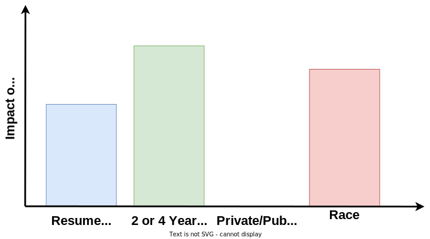

# Fair and Explainable AI (FaX-AI)

This is the official repository for fair learning methods that remove *direct direction* without the induction of *indirect discrimination*. These methods are based on a joining of concepts in fairness and explainability literature in machine learning. They inhibit discrimination by nullifying the influence of the protected feature on a system's output, while preserving the influence of remaining features.

This connection and the associated methods are detailed and evaluated in Marrying Explainable and Fair Supervised Models ([ICML SRML 21 workshop version](https://icmlsrml2021.github.io/files/24.pdf)).

## Fairness and Explainability Hiring Example
Say we want to create an machine learning system to decide who our company should hire from a pool of applicants with college degrees. Using our company's past and, unfortunately, biased hiring history we generate training data with the following information from applicants:
- The legibility of their resume (assuming we can objectively score this) :blue_square:
- Whether they have a 2 year or a 4 year degree :green_square:
- Whether they went to a public or a private college/university :yellow_square:
- Their race :red_square:
- The hiring outcome (Yes/No) :purple_square:

The following graphical models results from applying different a standard learning methods and our FaX-AI methods to this example scenario. The directed edges correspond to causal relations, while the dashed edges correspond to potential relationships. 

|  | Standard Learning  | FaX-AI Methods |
| ------------- | ------------- | ------------- |
| **Graphical Model**  |||

Additionally, let the following measures of the impact of features to these methods' output result from using explainability algorithms such as [SHAP](https://github.com/slundberg/shap). 
|  | Standard Learning  | FaX-AI Methods |
| ------------- | ------------- | ------------- |
| **Feature Impact**  |||

Therefore, the FaX AI methods permits the usage of features associated with the protected feature in accordance with the business necessity clause and drops the protected attribute from the without inducing indirect discrimination.

From these results we have the following pros and cons from these methods:
|  | Standard Learning  | FaX-AI Methods |
| ------------- | ------------- | ------------- |
| **Pros**  |<ul><li>Better replicates model from data generating process.</li><li>Potentially more accurate.</li></ul>|<ul><li>Prevents direct discrimination via race.</li><li>Allows for relevant attribute (degree type) to affect hiring outcome.</li></ul>|
| **Cons**  |<ul><li>Allows for direct dirscrimination via race.</li><li>Does not account for fairness.</li></ul>|<ul><li>Potentially more computationally expensive.</li><li>Worse accuracy than the standard model.</li></ul>|


## Installation

| Supported Python versions |
| -------------- |
| 3.7, 3.8, 3.9  |


### Using `pip`
For just our methods:
```bash
pip install TODO
```
For our methods and the examples using SHAP and fair learning methods and metrics:
```bash
pip install TODO[option]
```

### Installing Manually

Clone this repo and install the following:

1. For our methods, [Python >=3.7](https://www.python.org/downloads/release/python-370/), [numpy, scipy](https://www.scipy.org/scipylib/download.html), [scikit-learn](https://scikit-learn.org/stable/), and [PyTorch](https://pytorch.org/get-started/locally/).
2. For the examples and other methods, all of the above plus [matplotlib](http://matplotlib.org/), [AIF360](https://github.com/Trusted-AI/AIF360) and [Pandas](https://pandas.pydata.org/).

## Using Our Methods
All of our methods can be found within the file "fair_mass.py". The following classes have the implementations: Optimization, OIM, and MIM.

We include other implementations support our methods such as logistic regression, the underlying estimator for our methods, and the influence measures of SHAP and MDE.

Datasets must be in numpy-type arrays. Additionally, the protected attribute separated from other features when using our methods and be fed in as the 'Z' parameter. 'X' is the remaining features and 'Y' is the target.

Note that our methods train when they are initialized.

#### Example Dataset
We can observe how to use the models with a simple dataset.

While our methods can be used with any dataset that can be reprented as NumPy array. We generate a simple dataset using the code below as an example.
```python
import numpy as np

#Create some sample data to work with
#Create random values for non-protected attributes
X = np.random.random((1000, 3))
#Create random values for the protected attribute
Z = np.random.randint(2, size=1000).reshape(-1,1)

#Combine the attributes and generate binary outcome, Y, using this data
XZ = np.hstack([X,Z])
w = np.array([1.0, -2.0, 3.0, 2.0])
y = 1/(1 + np.exp(-XZ @ w))
Y = np.array(y >= 0.5, dtype=np.int32)
```
In our simple dataset we have 100 samples with 4 attributes and an outcome, Y. Three of the attributes, X, are genereated randomly and independently from the last attribute Z, the binary protected attribute. Joining X and Z simply gives us the samples with all of their features, XZ, however, for using our models it is important to note how that can be seperated. The outcome, Y, is generated by take the logistic sigmoid of our samples, XZ, multiplied by some weighting vector, w. In the example above, the protected attribute has a weight of 2.0 applied to it. Therefore, this dataset has direct discimination.

#### Our Methods
Usage is similar to popular libraries such as [scikit-learn](https://scikit-learn.org/stable/). The notable intracacies of our implementation is that users have to seperate their samples into non-protected attributes, X, and protected attribute, Z. All data inputed must be in numpy arrarys. Additionally, in this implementation we fit the model when we initialize a model's class object.

##### Marginal Interventional Mixture
The more computationally efficient of our methods is the marginal interventional mixture (MIM). The MIM is based on interventions from causal explainability literature
known as probabilistic interventions.
```python
import fair_mass
#Create the MIM model with the generated data
#Note that we already had X and Z seperated
model_MIM = fair_mass.MIM(X, Z, Y)

#generate some more data for non-protected attribute
pred_MIM = model_MIM.predict(X)
```
Due to the efficiency of this method, we suggest that new users focus on using the MIM before our other methods.

##### Optimization-Influence
The optimization method is a two-stage optimization-based method. It first drops the protected attribute, Z, from the dataset an trains a standard model minimizing cross-enthropy loss. Then it optimizes for the loss function based on input influence measures. This loss function is mimimized by preserving the influence of non-protected attributes, X, from the original standard model trained with all attributes. Currently we support two measures of influence, marginal direct effect (MDE), introduced in our [paper](https://icmlsrml2021.github.io/files/24.pdf), and [SHAP (SHapley Additive exPlanations)](https://github.com/slundberg/shap).
```python
import fair_mass
#Create an optimization model with the generated data
#Note that we already had X and Z seperated
model_OPT = fair_mass.Optimization(X, Z, Y, influence='shap')

#generate some more data for non-protected attribute
pred_OPT = model_OPT.predict(X)
```
Usage is similar to the MIM except users need to specify whether they shall use SHAP or MDE for the input influence measure. Due to the computational cost of calculating input influence, this method currently does not work for datasets with many features.

## Important Files in this Repo

#### fair_mass.py
- Main file containing the implementation of our methods and input influence measures.

### Example files
#### simple_example.py
- Shows how to use our Optimization method using randomly generated NumPy arrays.

#### compas_example.py
- Shows how to load and preprocess the COMPAS data from the [AIF360](https://github.com/Trusted-AI/AIF360) library and use it our Optimization.

### Folders
#### example
- Contains code for the Marrying Explainable and Fair Supervised Models results.
