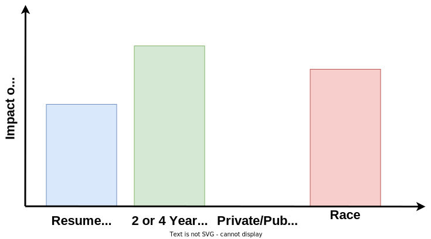
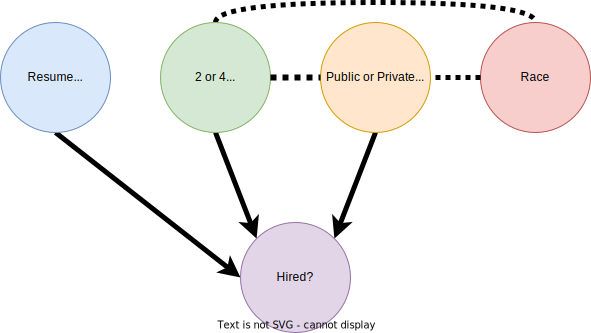
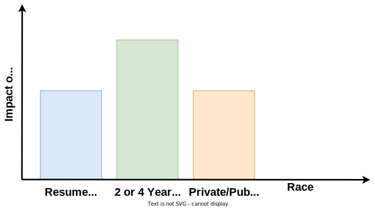
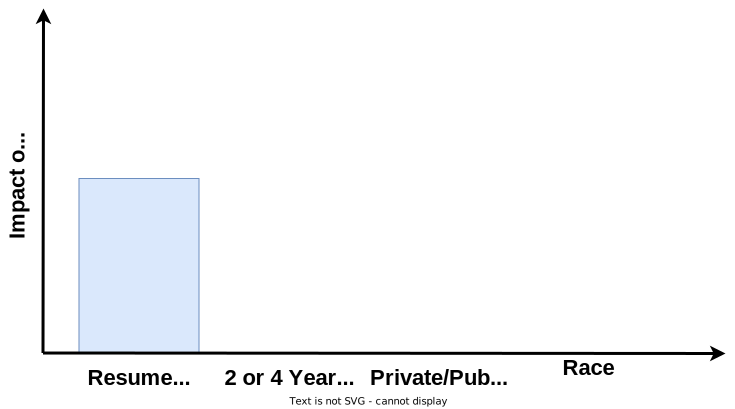
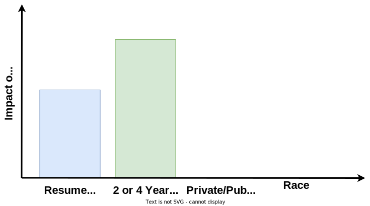

# Fairness and Explainability Hiring Example
Say we want to create an machine learning system to decide who our company should hire from a pool of applicants with college degrees. Using our company's past and, unfortunately, biased hiring history we generate training data with the following information from applicants:
- The legibility of their resume (assuming we can objectively score this) :blue_square:
- Whether they have a 2 year or a 4 year degree :green_square:
- Whether they went to a public or a private college/university :yellow_square:
- Their race :red_square:
- The hiring outcome (Yes/No) :purple_square:

Let's say that the following graphical model results from our data generating process. The directed edges correspond to causal relations, while the dashed edges correspond to potential relationships.

  

Since there was a casual relation between race and our hiring outcomes in the model above, we say that our historical hiring model was directly dicriminatory. The goal of standard learning models is to obtain a model trained on a dataset that can predict outcomes. If the dataset is tainted by discrimination, like in our example, then models trained using it can perpetuate this discimination.

While there are many statistical notions of fairness to measure discrimination for these models, we propose it can also be measured using explainability methods that measure the impact of features to a model’s output. Say that we trained a standard learning model trained on our hiring dataset and it produces the following measures of impact:

  

As we can see above, race has in impact on our trained model's output for hiring decisions. Therefore, we can say that it is discriminating directly. In general, we propose that any model that has a protected feature, such as race, impact it's output is directly discriminatory.

Our company definitely wants to make sure that we do not perpetuate this discrimination by race. Therefore, we ask how can we apply an algorithm that accomplishes this?

### Standard Learning Dropping Race
Since we know that the training dataset is discriminatory, we might want drop the protected feature, race, when training a standard learning model. This, however, is too naïve and results in the following graphic model and feature impact measures.

  
  

This approach removes the relation and impact of race, however, it introduces a relation and impact from "public or private institution", a feature potentially related to race. We refer to this as the inducement of indirect discrimination. With absence of the protected feature, this approach uses related feature(s) as a proxy, thus inducing indirect discrimination.

### Common Fair Learning Methods
Alternatively, we can try to use a method based on well-known fairness objective, such as parity of impact, leading to following graphic model and feature impact:

  
  

While this removes all direct and indirect discrimination by removing the impact of both features potentially related to race, this may not be desirable. Legal systems may allow for the usage of these features through the business necessity clause. Given its relevance to a job, the usage of whether an applicant has an associates degree or a bachelors degree may be legally permitted in our hiring case.

### Our Methods
Therefore, in this repository we introduce fair learning algorithms that permits usage of features associated with the protected feature in accordance with the business necessity clause and drops the protected attribute from the without inducing indirect discrimination. This results in the following graphic model and feature impact measures in our hiring example:

  
  

Above, our methods permits the usage of applicants' undergraduate degree type and removes the impact of the protected feature, race, without introducing an impact from "public or private institution" on the model's output.
